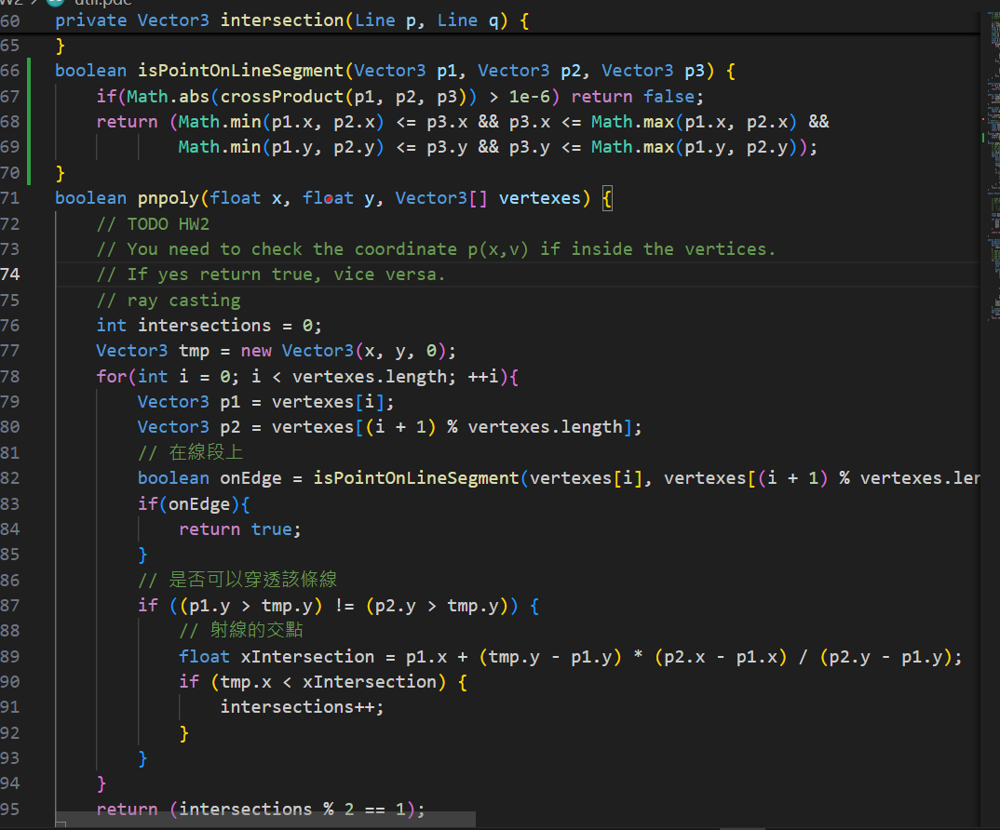
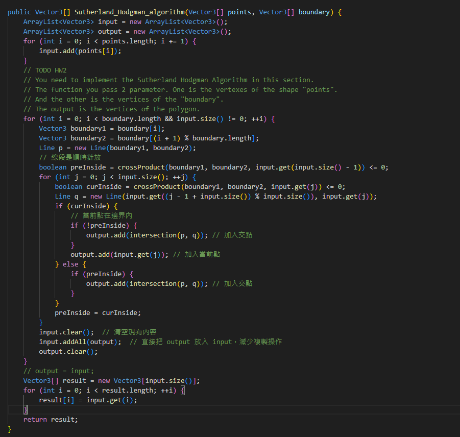
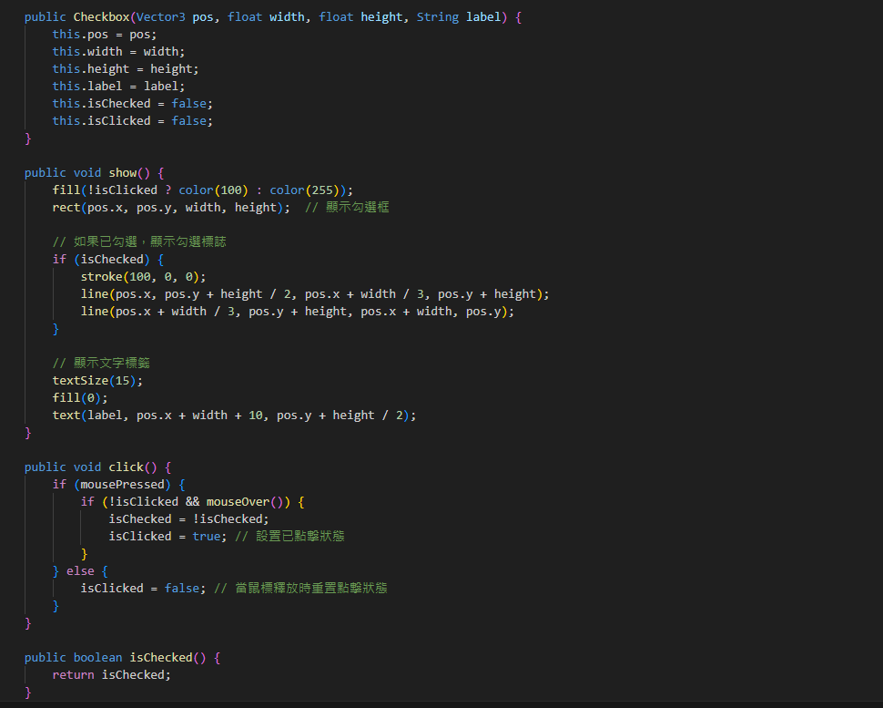
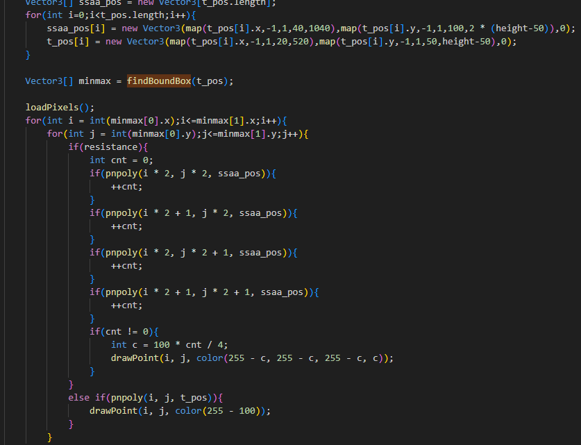
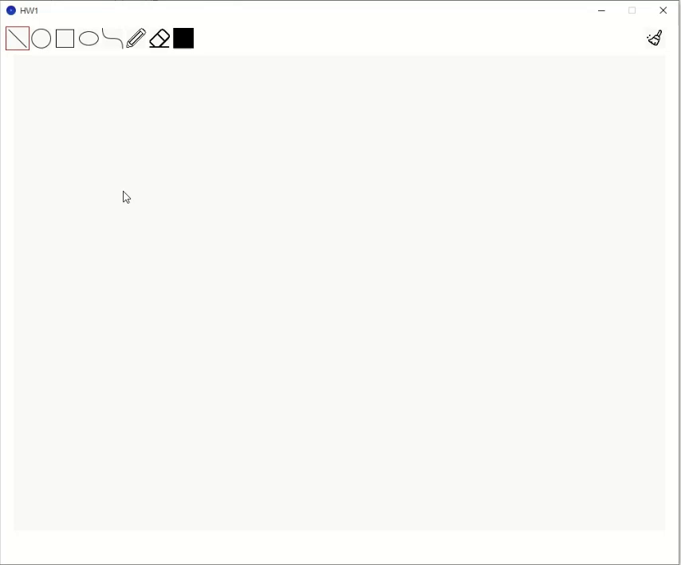
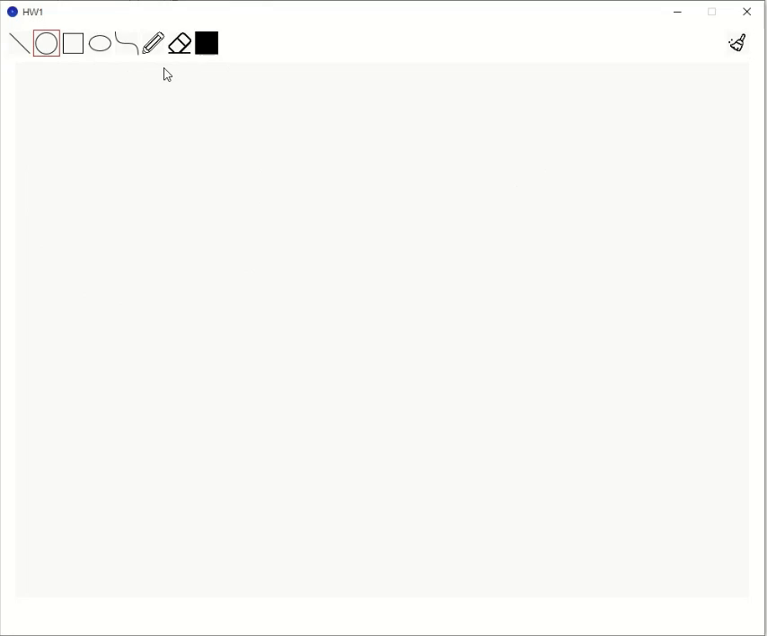
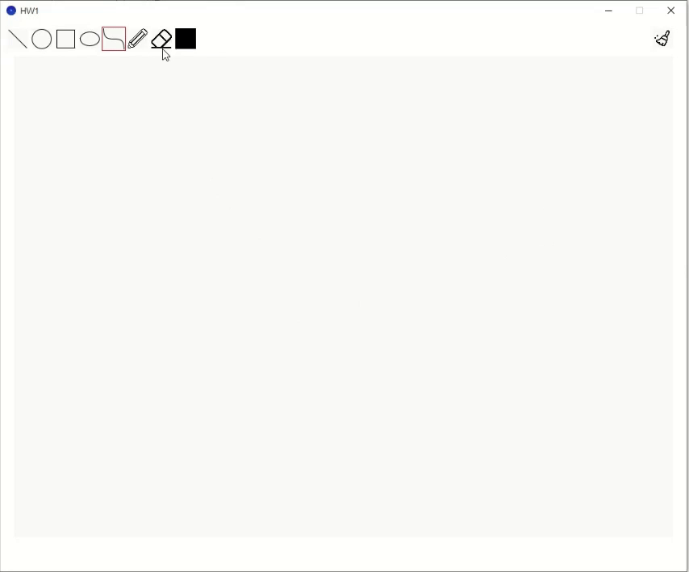
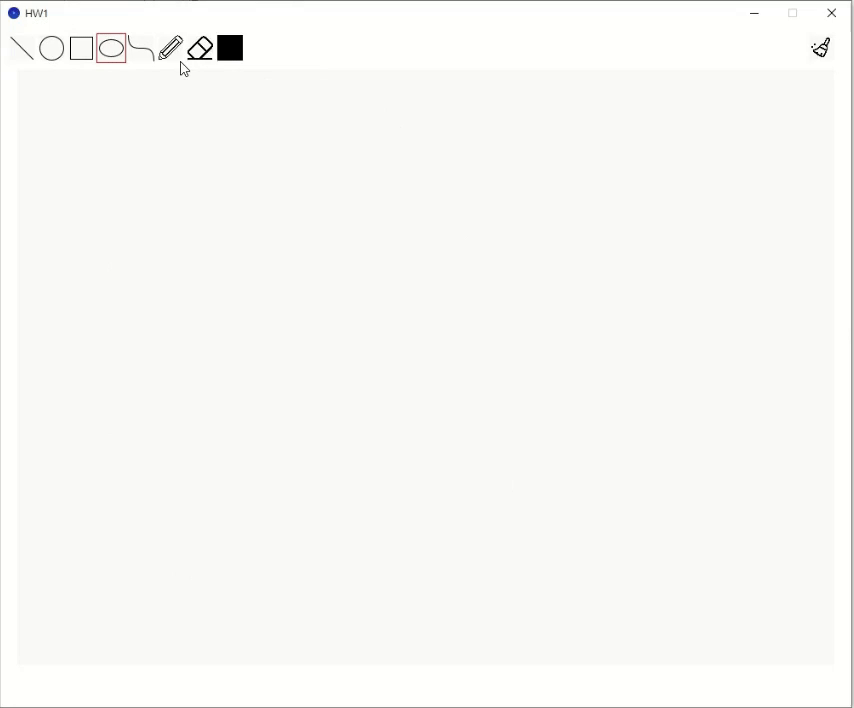
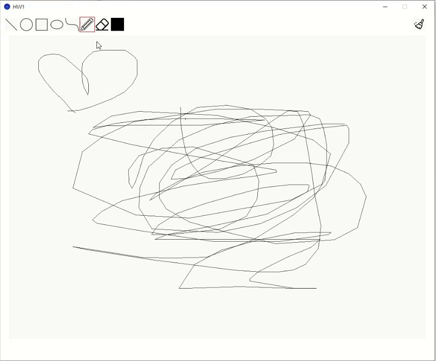
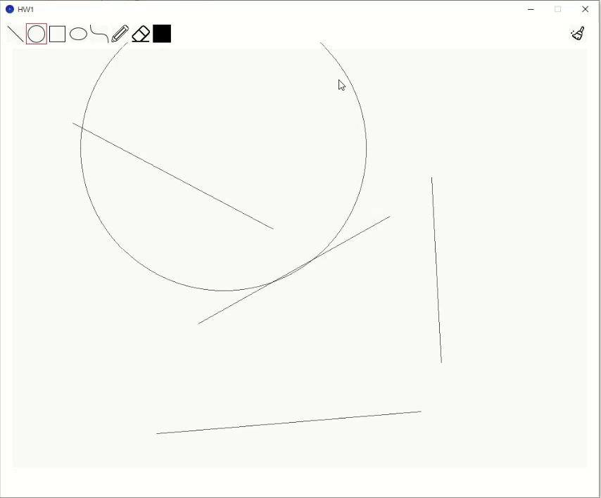

# computer-graphic_HW2

## 描述
1. 這是一個2D小畫家，可供使用者繪圖，旋轉、縮放、平移，並處理了圖像不夠連續的問題。
2. 使用工具：延伸閱讀、上課教材、ChatGPT

## 功能說明
1. 可做移動、旋轉、縮放  
   - 透過 Matrix 將物件從 Local Space 轉至 World Space  
   - 在 Homogenious Space 做空間轉換  

2. 將圖形填滿顏色  
   - 透過 Ray Casting 檢測要填滿的地方  
   - 透過物件的頂點資訊調整 Ray Casting 檢測範圍  

##### 功能 1&2 程式碼及展示

|  |  |  |
|---------------------------------------|-------------------------------------------|------------------------------------------|

3. 偵測畫框邊緣  
   - 透過圖形線段與外框的線段判斷有無交點，修改當前繪製圖像的形狀  

##### 功能 3 程式碼及展示

|  |  |
|--------------------------------------------|--------------------------------------------|

4. SSAA  
   - 做一個 2*2 的 cell 去降低邊緣不夠連續的問題  
   - 使用 checkbox 讓每個物件都可以獨立調整是否要 SSAA  
   - 這邊只是呈現我能透過該方法改善，並沒有讓它能完成騙過肉眼（計算量有點大）  

##### 功能 4 程式碼及展示

|  |  |
|--------------------------------------|-------------------------------------|

## 成果展示

------------------------------------------------------------------

# computer-graphic_HW1

## 描述
1. 這是一個小畫家，目前支援繪製點、線以及一些基本圖案。  
2. 參考教材：上課筆記、延伸閱讀、ChatGPT

## 功能說明
1. 畫線  
   - 透過中點演算法  
   - 考慮斜率降低誤差  

2. 畫多邊形  

3. 隨意畫  

4. 畫圓  
   - 透過中點演算法  
   - 透過圓的對稱性減少計算  

5. 畫橢圓  
   - 透過中點演算法  
   - 考慮斜率降低誤差  
   - 透過橢圓的對稱性減少計算  

6. 畫曲線  
   - 透過曲線公式  

7. 擦除（滾動滑鼠即可改變擦除範圍）  

## 成果展示

