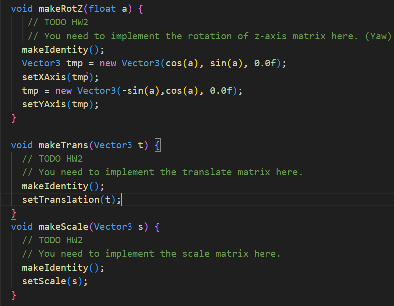

# computer-graphic_HW2

## 描述
1.這是一個2D小畫家，可供使用者繪圖，旋轉、縮放、平移、並處理了圖像不夠連續的問題
2.使用工具：延伸閱讀、上課教材、ChatGPT

## 功能說明
1.可做移動、旋轉、縮放
 -透過 Matrix 將物件從 Local Space 轉至 World Space
 -在 Homogenious Space 做空間轉換

2.將圖形填滿顏色
 -透過 Ray Casting 檢測要填滿的地方
 -透過 物件的頂點資訊調整 Ray Casting 檢測範圍

##### 功能1&2程式碼及展示

 

  

    
  

  

    
  

  

    
  

3.偵測畫框邊緣
 -透過圖形線段與外框的線段判斷有無交點，修改當前繪製圖像的形狀

##### 功能3程式碼及展示

  

    
  

  

    
  

4.SSAA
 -做一個 2*2 的 cell 去降低邊圓不夠連續的問題
 -使用 checkbox 讓每個物件都可以獨立調整是否要 SSAA
 -這邊只是呈現我能透過該方法改善，並沒有讓它能完成騙過肉眼(計算量有點大)

##### 功能4程式碼及展示

  

    
  

  

    
  

## 成果展示

------------------------------------------------------------------

# computer-graphic_HW1

## 描述
1.這是一個小畫家，目前支援繪製點、線以及一些基本圖案
2.參考教材：上課筆記、延伸閱讀、ChatGPT

## 功能說明
1.畫線
 -透過中點演算法
 -考慮斜率降低誤差

2.畫多邊形

3.隨意畫

4.畫圓
 -透過中點演算法
 -透過圓的對稱性減少計算

5.畫橢圓Markdown
 -透過中點演算法
 -考慮斜率降低誤差
 -透過橢圓的對稱性減少計算

6.畫曲線
 -透過曲線公式

7.擦除(滾動滑鼠即可改變擦除範圍)

## 成果展示

